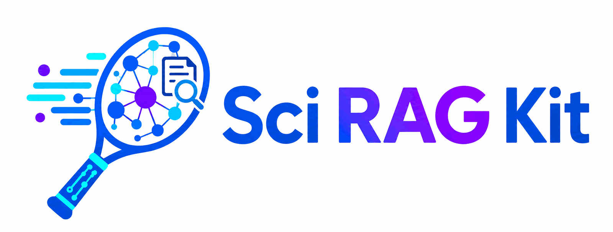

<p align="center">
  
</p>

<p align="center">
  <a href="https://github.com/sustainability-software-lab/sci-rag-kit/actions/workflows/ci.yml"></a>
  <a href="https://sustainability-software-lab.github.io/sci-rag-kit/"></a>
  <a href="LICENSE"></a>
  
</p>

A template repository for retrieval-augmented generation over scientific
document collections, on one Postgres database. It implements hybrid GraphRAG
retrieval, grounded answer generation with citations, an evaluation harness,
and REST API plus MCP endpoints.

Read the [documentation site](https://sustainability-software-lab.github.io/sci-rag-kit/)
for the guided path, or go directly to the
[methodology](docs/methodology.md) for the design specification.

To start a new project, use GitHub's **Use this template**, run the
quickstart below against the bundled demo corpus, then replace the demo
domain with your own.

## Components

- **Ingestion**: PDF/Markdown/text parsing (Docling when installed, pypdf
  fallback), structure-aware chunking that preserves section hierarchy and
  keeps tables intact, content-hash deduplication, per-document license
  metadata.
- **Retrieval**: five candidate generators run in parallel and fuse by
  weighted reciprocal rank: dense vectors (pgvector + HNSW), Postgres
  full-text search, knowledge-graph traversal, community summaries, and
  HyDE. Per-stage timeouts, traces, and graceful degradation.
- **Knowledge graph**: LLM extraction of entities and typed relationships
  constrained to a user-defined ontology (`domain/domain.yaml`), with
  evidence provenance per edge; deterministic community detection with
  LLM-written, embedded summaries. Stored as ordinary Postgres rows; no
  separate graph database (see ADR 0001).
- **Access control on content**: each document carries a redistribution
  class (`public`, `open_commercial`, `open_noncommercial`, `restricted`,
  `unknown`). Retrieval scopes are applied inside every layer's SQL before
  ranking; an empty allowlist returns nothing.
- **Answering**: numbered inline citations tied to retrieved sources;
  when retrieval finds nothing in scope, the system states that instead of
  answering from model priors.
- **Model providers**: Gemini, Claude, and any OpenAI-compatible endpoint,
  chosen per role with a `provider:model` setting. On Google Cloud that
  reaches the Vertex Model Garden partner models (Claude, Grok, Llama,
  Mistral) with no credentials beyond the project you already have.
- **Evaluation**: expert-authored seed questions, retrieval metrics
  (hit@k, MRR) with per-layer ablation configs, and a two-pass LLM judge:
  the grounding pass never sees the reference answer, and correctness is
  graded separately against it. Reports are stamped with a corpus
  fingerprint and git commit.
- **Serving**: a FastAPI service (`/v1`, OpenAPI at `/docs`) and an MCP
  server (eight tools, mounted at `/mcp` and runnable over stdio) backed by
  the same service instance. Static API keys with scopes and rate limits,
  an interface seam for OAuth, and per-request LLM key override.

Everything runs in a single PostgreSQL database: text, vectors, full-text
indexes, and the graph.

## Quickstart

Requirements: [uv](https://docs.astral.sh/uv/), Docker (for Postgres), and
optionally a [Google AI Studio API key](https://aistudio.google.com/apikey)
or Vertex AI credentials for real embeddings and generation.

```bash
git clone https://github.com/sustainability-software-lab/sci-rag-kit.git
cd sci-rag-kit

cp .env.example .env
# In .env, set one of:
#   SCI_RAG_GOOGLE_API_KEY=...              AI Studio key
#   SCI_RAG_GCP_PROJECT=...                 Vertex AI (after gcloud auth application-default login)
#   SCI_RAG_EMBEDDING_PROVIDER=local-hash   offline mode: no credentials, lexical-only retrieval, no generation
# To generate with Claude or Grok instead of Gemini, see docs/extend.md.

make setup     # uv sync, start Postgres (port 5433), create the schema
make demo      # ingest the demo corpus, run a traced retrieval, score it
```

With credentials configured, generation and the graph work too:

```bash
uv run sci-rag answer "What conversion route suits rice straw given its ash content?"
make demo-cloud   # graph extraction + communities + a deep answer + ablation report
uv run sci-rag serve   # REST at /docs, MCP at /mcp
```

Example answer from the demo corpus (five numbered sources across three documents, all claims cited):

> Given its ash content, anaerobic digestion is a suitable conversion
> route for rice straw [2][4]. Rice straw has an ash content near 18
> percent, which includes high silica [2]. This high ash and silica limit
> direct combustion [2] and prevent its use in gasifiers due to
> accelerated clinker formation [5]. ... a mild alkali soak raises the
> biogas yield to 320 cubic meters per dry ton [1][3].

The demo corpus is five synthetic documents about agricultural residues
(realistic form, fictional numbers, CC0), included so the pipeline can be
exercised end to end before you commit your own documents.

## Customizing to your domain

1. Put documents in `data/raw/` and describe them in a JSONL corpus
   manifest (title, authors, license class, source).
2. Edit `domain/domain.yaml`: entity types, relationship types, and HyDE
   query classes for your field.
3. Adjust the wording of the prompts in `domain/prompts/` where needed.
4. Write 10 to 20 ground-truth questions in
   `domain/eval_seed_questions.jsonl`.
5. Run `sci-rag ingest`, `sci-rag graph extract`, `sci-rag graph
   communities`, then `sci-rag eval retrieval --ablation`.

The step-by-step version with worked examples is
[docs/bring-your-own-domain.md](docs/bring-your-own-domain.md).
`uv run python scripts/init_domain.py` handles the rebranding (project
name, description, seed-question reset).

## Repository layout

```
domain/            Ontology, prompts, seed questions (the specialization surface)
src/sci_rag/       ingest, embed, graph, retrieve, answer, evals, server, cli
data/demo/         Demo corpus (synthetic, CC0; optional)
migrations/        Alembic schema (pgvector + HNSW + FTS indexes)
tests/             Offline test suite (runs against the docker-compose Postgres)
infra/terraform/   Optional GCP deployment (Cloud SQL + Cloud Run)
docs/              Methodology, tutorials, API reference, ADRs
```

## CLI

| Command | Purpose |
|---------|---------|
| `sci-rag db upgrade` | Create or upgrade the database schema |
| `sci-rag ingest <folder>` / `--manifest file.jsonl` | Parse, chunk, embed, store |
| `sci-rag corpus enrich --mailto you@example.org` | Add Crossref journal, citation-count, and retraction metadata (`--dry-run` first) |
| `sci-rag campaign discover --topic ... \| --doi-file ...` | Build a deduplicated, resumable DOI list through OpenAlex or Crossref |
| `sci-rag campaign build --topic ... \| --doi-file ... --dry-run` | Map explicit license signals, download verified direct OA PDFs, and write an ingest manifest |
| `sci-rag campaign screen --name ... --criteria-file ...` | Screen discovered abstracts and route uncertain or invalid model results to human review |
| `sci-rag campaign review --name ...` | Walk the pending review queue and append explicit human decisions |
| `sci-rag graph extract` | Extract entities and relationships from chunks |
| `sci-rag graph resolve-entities --dry-run` | Preview alias, fuzzy, and optional LLM duplicate-entity merges |
| `sci-rag graph citations --dry-run` | Reconcile cached Crossref references into resolved and unresolved DOI pointers |
| `sci-rag graph communities` | Cluster the graph and write summaries |
| `sci-rag retrieve "question"` | Ranked results with per-layer traces (filter with `--year-min/--year-max/--author/--journal/--exclude-doi/--license/--source`) |
| `sci-rag answer "question"` | Grounded answer with citations; known retracted papers excluded by default |
| `sci-rag eval retrieval [--ablation]` | Retrieval metrics against seed questions |
| `sci-rag eval answers` | Generate and judge answers |
| `sci-rag serve` | REST + MCP server |
| `sci-rag mcp` | MCP over stdio (for local agents) |
| `sci-rag stats` | Corpus contents and relationship-confidence summary |
| `sci-rag doctor` | Check config, database, corpus, and credentials in one pass |

Register the MCP server with a local agent:

```bash
claude mcp add my-corpus -- uv run --directory /path/to/your/repo sci-rag mcp
```

## Documentation

The complete, searchable site is published at
[sustainability-software-lab.github.io/sci-rag-kit](https://sustainability-software-lab.github.io/sci-rag-kit/).

| | |
|---|---|
| [Quickstart](docs/quickstart.md) | Setup, first run, troubleshooting |
| [FAQ](docs/faq.md) | Short answers, and the reasoning behind each design decision |
| [Bring your own domain](docs/bring-your-own-domain.md) | Specialization tutorial |
| [Corpus campaigns](docs/campaigns.md) | Polite, resumable discovery from topics or DOI seeds |
| [Methodology](docs/methodology.md) | Design rationale for every component |
| [Architecture](docs/architecture.md) | Code layout, data model, extension points |
| [Evaluation guide](docs/evaluation.md) | Seed questions, ablations, the judge |
| [Benchmarks](docs/benchmarks.md) | Measured demo-corpus results, reproducible via make benchmark |
| [Choosing sci-rag-kit](docs/choosing-sci-rag-kit.md) | Honest comparison vs GraphRAG, LightRAG, PaperQA2, LlamaIndex |
| [Roadmap](docs/ROADMAP.md) | Waves 2-3, collaboration seams, launch-gated decisions |
| [API reference](docs/api.md) | REST endpoints, MCP tools, auth, error codes |
| [Deploying on Google Cloud](docs/deploy-gcp.md) | Cloud SQL + Cloud Run via Terraform |
| [Decision records](docs/adr/) | Postgres-native graph, embedding dimensions, Docling, template format |
| [Versioning](docs/VERSIONING.md) + [Governance](docs/GOVERNANCE.md) | What 0.x promises; how decisions get made |
| [Adopters](ADOPTERS.md) | Who runs a knowledge base built from the kit |

## Defaults and requirements

Python 3.11+; PostgreSQL 15+ with pgvector (provided by
`docker-compose.yml`). Default models: `gemini-embedding-001` at 1536
dimensions (within pgvector's HNSW index limit; see ADR 0002) and
`gemini-2.5-flash` for generation, via AI Studio key or Vertex AI. A
deterministic offline embedder covers tests and credential-free runs.
Docling is an optional extra (`uv sync --extra docling`) because of its
install size; without it, PDF parsing falls back to pypdf at reduced table
fidelity.

## License

BSD 3-Clause. See [LICENSE](LICENSE).
