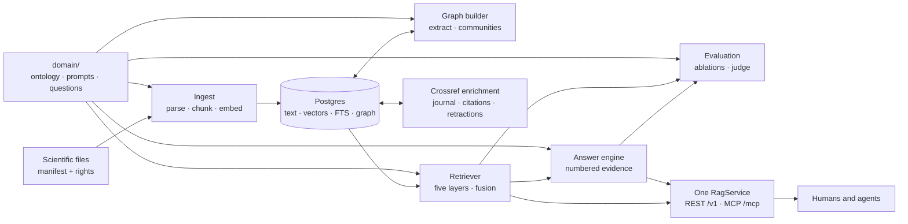
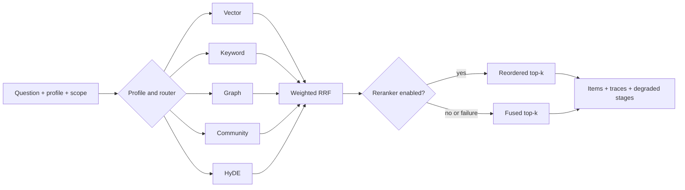

# Architecture

Sci RAG Kit moves documents and questions through one pipeline backed by Postgres. Each package
owns one stage and exposes a specific extension point. [Methodology](methodology.md) explains the
scientific and retrieval choices behind the design.

## The map

The domain profile shapes extraction, retrieval, answering, and evaluation. Both network interfaces call the same service facade, so every evidence-bearing path returns to the same document and chunk rows.

Package by package (`src/sci_rag/`):

| Package | Responsibility | Extension point |
|---------|----------------|---------------------|
| `config` | pydantic-settings; every knob is an `SCI_RAG_*` env var | `get_settings()` |
| `domain` | loads and validates `domain/` (ontology, prompts, tuning) | `DomainProfile` |
| `db` | SQLAlchemy models, async engine, Alembic migrations | `session_scope()`, models |
| `ingest` | parsers (Docling/pypdf/markdown/html), chunker, manifest, ingester | `ingest_entries()` |
| `campaigns` | bounded discovery, explicit OA resolution, verified PDF download, protocol screening, PRISMA-aligned reporting, manifest output, and append-only resumable state | `discover_by_topic()`, `build_campaign()`, `screen_campaign()`, `CampaignState` |
| `enrich` | Crossref journal, citation-count, and explicit retraction metadata | `enrich_documents()` |
| `embed` | `EmbeddingProvider` interface; Google + offline hash implementations | `get_embedder()` |
| `llm` | `LLMClient` interface; Google, Anthropic, and OpenAI-compatible implementations; `MockLLM` for tests | `get_llm()` |
| `graph` | entity/relation extraction, community detection + summaries | `extract_graph()`, `build_communities()` |
| `retrieve` | five stages, RRF fusion, scope, the orchestrator | `Retriever.retrieve()` |
| `answer` | optional snippet compression, prompt assembly, citations, streaming events | `AnswerEngine.answer_stream()` |
| `evals` | seed questions, metrics, ablations, blind judge, reports | `run_retrieval_eval()`, `run_answer_eval()` |
| `draft` | model-drafted domain files, grounded in the corpus and verified in Python before anything is written | `draft_questions()`, `sample_corpus()` |
| `server` | FastAPI app, auth, schemas, MCP server | `create_app()`, `build_mcp_server()` |
| `cli` | Typer commands wiring it all together | `sci-rag ...` |

Application code calls `Retriever.retrieve()` and `AnswerEngine`; stage SQL stays inside
`retrieve/`. REST and MCP both call `RagService`, so authentication, scope, citations, errors, and
results share one service contract.

The answer engine retains two evidence views when contextual compression is enabled. `retrieval` holds the complete retrieved chunks and their provenance. `prompt_retrieval` holds the exact summaries shown to the answer model and the blind grounding judge. Both views retain the same document and chunk IDs. A malformed or failed summary falls back to complete source text and increments a visible failure count.

The shipped demo enables compression at `relevance_floor: 0.0`, which summarizes every source and drops none. That is the setting where its paired judged-answer gate holds; the numbers are on the [benchmarks page](benchmarks.md). A higher floor discards sources and the gate stops holding. Your own domain profile must run that gate before changing either value. Compression cannot create citation targets.

## Retrieval flow

The five candidate sources run concurrently where their dependencies allow, then fuse once. Each layer applies scope conditions in its database query before ranking.

Vector and community retrieval share one shielded query-embedding task. Graph and HyDE use the configured model when enabled. Each stage owns its timeout and session. Failure becomes a trace while other candidates continue.

## Data model

Seven application tables share one database.

* `documents`: source identity, citation metadata, license class, content hash (unique; the dedup backstop), and sparse Crossref enrichment including explicit retraction status.
* `chunks`: the retrieval unit. Text, token count, section path, `is_table`, a pgvector embedding (HNSW indexed) with its `embedding_version`, a generated `search_tsv` full-text column (GIN indexed), and `graph_extracted_at`. NULL means the graph builder has not seen it yet; this is how incremental extraction finds work.
* `document_citations`: resolved and unresolved DOI references between documents, kept separate from ontology relationships.
* `kg_entities`: canonical by name, type from the ontology, retained source aliases, evidence pointers (`chunk_ids`, `document_ids`).
* `entity_resolution_audit`: the durable record of each applied entity merge.
* `kg_relationships`: directed typed edges with the quoted evidence phrase, its chunk, and calibrated confidence (1.0 for direct statements, 0.7 for strong implications, 0.4 for cross-sentence inferences). Repeated extraction preserves the highest observed confidence for the typed edge on each document and chunk evidence surface.
* `kg_communities`: cluster membership, an LLM summary, and the summary's embedding.

A migration fixes the embedding dimension from `SCI_RAG_EMBEDDING_DIM` (default 1536). The provider asserts it on every call; the column enforces it on every insert. Changing the dimension requires a migration plus full re-embed, never an implicit drift.

## Concurrency model

Database and retrieval paths use asyncio, SQLAlchemy async, and asyncpg. The retrieval orchestrator
runs each enabled stage as its own task and database session because asyncpg cannot multiplex one
session. Each task has an `asyncio.wait_for` timeout.

Vector and community retrieval await one shielded query-embedding task. A timeout in one stage
cannot cancel that shared work for another. A failed stage records `error`, contributes no
candidates, and leaves the other stages running.

## Error and degradation philosophy

* A failed retrieval layer contributes no candidates and appears in `traces` and `degraded_stages`.
* Ingestion fails per document, never per corpus. Every failure is a row in the report with a reason.
* Fail-closed beats fail-open where rights matter: empty license scope returns nothing; `unknown` license is unsafe; the community layer refuses scoped requests.
* Every layer applies its license, source, year, author, journal, document, and DOI conditions before it orders or limits candidates.
* The kit validates anything a model returns (ontology types, judge scores, JSON shapes) before touching the database. It drops malformed output.
* Campaign screening is stricter than ordinary retrieval degradation. A malformed response, missing abstract, or low-confidence decision becomes a human-review row. It can never become an exclusion implicitly.

## The server

`create_app()` builds one FastAPI process serving REST under `/v1` (OpenAPI at `/docs`), the MCP server mounted at `/mcp` over streamable HTTP, and health/manifest endpoints. Cross-cutting pieces follow.

* **Auth** is a backend interface. The shipped `StaticKeyBackend` reads a JSON key map (scopes + per-key rate limits) from `SCI_RAG_API_KEYS`. No keys means open mode with a loud startup warning. Swapping in OAuth takes one constructor call in `create_app`. The same backend guards `/mcp` through a small ASGI wrapper.
* **Errors** are RFC 9457 `application/problem+json` with stable `code` values and an `X-Request-ID` on everything.
* **Streaming** uses Server-Sent Events (sse-starlette) with typed events. The non-streaming JSON mode aggregates the same event stream, so the two modes never disagree.
* **BYO keys**: the server threads a request-supplied LLM key (gated by the `byo_llm` scope) or a per-key binding into a per-request client. It stores neither and logs neither.

For agents over stdio (Claude Code and friends), `sci-rag mcp` runs the same tool set with logs forced to stderr, because stdout is reserved for the protocol.

## Where a change belongs

| You want to change | Start here | Keep invariant |
|---|---|---|
| Scientific concepts and relations | `domain/domain.yaml` | Valid entity and relation names |
| How the model extracts or answers | `domain/prompts/` | Required `$SLOTS` and the citation contract |
| Which documents enter the corpus | `data/corpus.jsonl`, or a `CorpusEntry` collector | Source, rights, and identity metadata |
| Which works to review and download | `sci-rag campaign discover` and `build` | Resumable state, explicit rights, verified direct PDFs |
| A file format | `src/sci_rag/ingest/parsers.py` | The shared `ParsedDocument` block model |
| Model provider | `EmbeddingProvider` or `LLMClient` | Dimensions, version stamps, async behavior |
| Ranking behavior | `src/sci_rag/retrieve/` | Scope before ranking, traces, and ablation evidence |
| External interface | `RagService` first, then the REST or MCP adapter | One behavior behind both front doors |

The first four rows are the configuration and data entry points for adapting a project.

## Extension points, in order of likely need

1. **A new document parser**: add a branch in `ingest/parsers.py::parse_file` producing the shared block model.
2. **A new corpus collector** (S3, an API): produce `CorpusEntry` rows. Nothing downstream changes.
3. **A reranker**: implement the `Reranker` protocol and add an ablation config so the adapter must prove itself.
4. **A different embedding or LLM provider**: implement the two-method `EmbeddingProvider` / `LLMClient` interfaces. Stamp a distinct `version` so re-embedding stays findable.
5. **A different auth backend**: implement `AuthBackend` (authenticate + rate check) and wire it into the application factory. The shipped `create_app()` selects open or static-key mode from settings.

## What is deliberately absent

The kit has no task queue, cache service, vector-store sidecar, graph database, or plugin
framework. The [decision records](adr/0001-graph-in-postgres.md) explain the accepted architecture
and its reversal conditions. [Extend the kit](extend.md) walks through each extension point and the evidence a
change owes.
