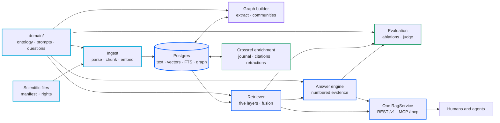
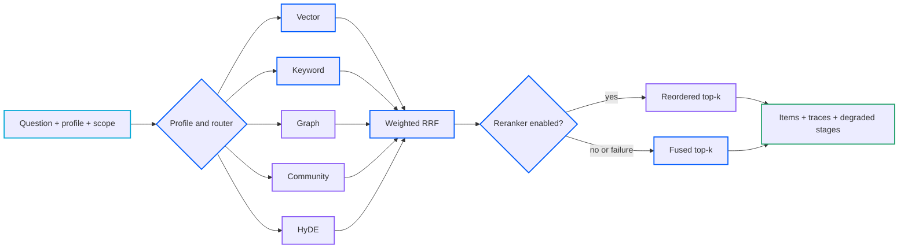

# Architecture

How the code is organized, what talks to what, and where the seams are.
For the reasoning behind the retrieval design itself, read
[methodology.md](methodology.md) first; this page is about the software.

## The map

The domain profile shapes extraction, retrieval, answering, and evaluation without becoming a second application. Both network interfaces call the same service facade, and every evidence-bearing path returns to the same document and chunk rows.

Package by package (`src/sci_rag/`):

| Package | Responsibility | The seam it exposes |
|---------|----------------|---------------------|
| `config` | pydantic-settings; every knob is an `SCI_RAG_*` env var | `get_settings()` |
| `domain` | loads and validates `domain/` (ontology, prompts, tuning) | `DomainProfile` |
| `db` | SQLAlchemy models, async engine, Alembic migrations | `session_scope()`, models |
| `ingest` | parsers (Docling/pypdf/markdown), chunker, manifest, ingester | `ingest_entries()` |
| `campaigns` | bounded discovery, explicit OA resolution, verified PDF download, manifest output, and append-only resumable state | `discover_by_topic()`, `build_campaign()`, `CampaignState` |
| `enrich` | Crossref journal, citation-count, and explicit retraction metadata | `enrich_documents()` |
| `embed` | `EmbeddingProvider` interface; Google + offline hash implementations | `get_embedder()` |
| `llm` | `LLMClient` interface; Google implementation + `MockLLM` | `get_llm()` |
| `graph` | entity/relation extraction, community detection + summaries | `extract_graph()`, `build_communities()` |
| `retrieve` | five stages, RRF fusion, scope, the orchestrator | `Retriever.retrieve()` |
| `answer` | prompt assembly, citations, streaming events | `AnswerEngine.answer_stream()` |
| `evals` | seed questions, metrics, ablations, blind judge, reports | `run_retrieval_eval()`, `run_answer_eval()` |
| `server` | FastAPI app, auth, schemas, MCP server | `create_app()`, `build_mcp_server()` |
| `cli` | Typer commands wiring it all together | `sci-rag ...` |

Two rules keep this navigable:

1. **Application code depends on facades, not internals.** Callers use
   `Retriever.retrieve()` and `AnswerEngine`; nothing outside
   `retrieve/` touches stage SQL.
2. **REST and MCP share one `RagService` instance.** The two front doors
   cannot drift apart because there is exactly one service behind both.

## Retrieval flow

The five candidate sources run concurrently where their dependencies allow, then fuse once. Scope conditions are part of each eligible layer's database query, not a cleanup step after ranking.

Vector and community retrieval share one shielded query-embedding task. Graph and HyDE use the configured model when enabled. A stage owns its timeout and session; its failure becomes a trace while other candidates continue.

## Data model

Five tables, one database:

* `documents`: source identity, citation metadata, license class,
  content hash (unique; the dedup backstop), and sparse Crossref
  enrichment including explicit retraction status.
* `chunks`: the retrieval unit. Text, token count, section path,
  `is_table`, a pgvector embedding (HNSW indexed) with its
  `embedding_version`, a generated `search_tsv` full-text column (GIN
  indexed), and `graph_extracted_at` (NULL means the graph builder has
  not seen it yet, which is how incremental extraction finds work).
* `kg_entities`: canonical by name; type from your ontology; retained
  source aliases; evidence pointers (`chunk_ids`, `document_ids`).
* `kg_relationships`: directed typed edges with the quoted evidence
  phrase, its chunk, and calibrated confidence (1.0 for direct
  statements, 0.7 for strong implications, and 0.4 for cross-sentence
  inferences). Repeated extraction preserves the highest observed
  confidence for the typed edge.
* `kg_communities`: cluster membership, an LLM summary, and the
  summary's embedding.

The embedding dimension is fixed at migration time from
`SCI_RAG_EMBEDDING_DIM` (default 1536). The provider asserts it on every
call; the column enforces it on every insert. Changing dimension is a
deliberate migration plus re-embed, never a drift.

## Concurrency model

Everything is asyncio end to end (SQLAlchemy async + asyncpg). The
retrieval orchestrator runs each enabled stage as its own task with its
own database session (asyncpg cannot multiplex one session) under its
own `asyncio.wait_for` timeout. The query embedding is computed once in
a shared task that vector and community both await (shielded, so one
stage's timeout cannot cancel it out from under the other). A failing
stage records `error` in its trace and contributes nothing; the request
survives.

## Error and degradation philosophy

* Layers degrade, requests survive, and the degradation is always
  visible (`traces`, `degraded_stages`) rather than silent.
* Ingestion fails per document, never per corpus; every failure is a row
  in the report with a reason.
* Fail-closed beats fail-open everywhere rights are involved: empty
  license scope returns nothing; `unknown` license is unsafe; the
  community layer refuses scoped requests outright.
* License, source, year, author, journal, document, and DOI conditions
  are applied before a layer orders or limits candidates.
* Anything a model returns is validated before it touches the database
  (ontology types, judge scores, JSON shapes) and dropped, not repaired,
  when malformed.

## The server

`create_app()` builds one FastAPI process serving REST under `/v1`
(OpenAPI at `/docs`), the MCP server mounted at `/mcp` over streamable
HTTP, and health/manifest endpoints. Cross-cutting pieces:

* **Auth** is a backend interface. The shipped `StaticKeyBackend` reads
  a JSON key map (scopes + per-key rate limits) from `SCI_RAG_API_KEYS`;
  no keys means open mode with a loud startup warning. Swapping in OAuth
  is one constructor call in `create_app`, and the same backend guards
  `/mcp` through a small ASGI wrapper.
* **Errors** are RFC 9457 `application/problem+json` with stable `code`
  values and an `X-Request-ID` on everything.
* **Streaming** uses Server-Sent Events (sse-starlette) with typed
  events; the non-streaming JSON mode aggregates the same event stream,
  so the two can never disagree.
* **BYO keys**: a request-supplied LLM key (gated by the `byo_llm`
  scope) or a per-key binding is threaded to a per-request client and
  never stored or logged.

For agents over stdio (Claude Code and friends), `sci-rag mcp` runs the
same tool set with logs forced to stderr, because stdout belongs to the
protocol.

## Extension points, in order of likely need

1. **A new document parser**: add a branch in
   `ingest/parsers.py::parse_file` producing the shared block model.
2. **A new corpus collector** (S3, an API): produce `CorpusEntry` rows;
   everything downstream is unchanged.
3. **A reranker**: implement the `Reranker` protocol and add an ablation
   config so the adapter has to prove itself.
4. **A different embedding or LLM provider**: implement the two-method
   `EmbeddingProvider` / `LLMClient` interfaces; stamp a distinct
   `version` so re-embedding stays findable.
5. **A different auth backend**: implement `AuthBackend`
   (authenticate + rate check) and wire it into your application factory;
   the shipped `create_app()` selects open or static-key mode from settings.

## What is deliberately absent

No task queue, no cache service, no vector-store sidecar, no graph
database, no plugin framework. Each was considered and declined for v1;
the [decision records](adr/0001-graph-in-postgres.md) hold the arguments,
including the conditions under which we would reverse them.
