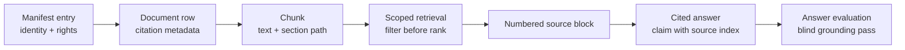

# Evidence and rights

Scientific retrieval is not trustworthy merely because an answer contains bracketed numbers. The system must preserve where evidence came from, keep ineligible text out before ranking, and make each displayed citation resolve to the actual retrieved source.

## The evidence chain

The manifest establishes identity and declared rights. Ingestion preserves title, authors, year, DOI, journal, URL, source bucket, and license class on the document; chunks keep their document ID and section path. Retrieval resolves fused candidates back to those rows before returning content. Answer generation numbers that exact result list and reports which sources were actually cited.

When a [corpus campaign](campaigns.md) creates the manifest, discovery remains candidate metadata only. `campaign build --dry-run` resolves Unpaywall's explicit location license without downloading; the applied build accepts only a direct open-access PDF that passes content-type, size, and signature checks. Missing or unrecognized license signals stay `unknown`, and each manifest row retains the original signal in `license_source`.

## License classes

Every document receives one class. Missing or unrecognized input normalizes to `unknown`.

| Class | Intended meaning | Typical examples |
|---|---|---|
| `public` | Public domain or equivalent; safe to redistribute | CC0, many US federal works |
| `open_commercial` | Open license permits commercial reuse with its conditions | CC BY, CC BY-SA |
| `open_noncommercial` | Open license restricts commercial reuse | CC BY-NC variants |
| `restricted` | The operator may hold the source but not redistribute its text | Paywalled version of record, proprietary report |
| `unknown` | Nobody has established the rights | Default for incomplete metadata |

The taxonomy is operational, not legal advice. Record the actual license and retain any required attribution outside this field as part of corpus governance.

`public` and `open_commercial` are the codebase's predefined safe classes for surfaces you do not fully control. A deployment still has to choose and enforce its own request scope.

## Scope precedes ranking

A `RetrievalScope` can constrain:

- license classes and source buckets;
- excluded document IDs;
- minimum and maximum publication year;
- exact stored author or journal values;
- excluded DOI values;
- documents explicitly flagged as retracted by Crossref.

Each eligible layer adds those conditions to its SQL before ordering and limiting candidates. Post-filtering would be unsafe and statistically wrong: an ineligible document could occupy a bounded top-k slot, influence fusion, then disappear while suppressing eligible evidence.

Two distinctions matter:

- `license_classes=None` means the caller did not restrict by license.
- `license_classes=()` means the caller explicitly allows nothing, so retrieval returns nothing.

Unknown does not silently enter a requested safe allowlist. A caller must ask for `unknown` by name.

## Retraction status is explicit, not inferred

`sci-rag corpus enrich` can add Crossref journal, citation-count, and
retraction metadata to DOI-bearing documents. Run it with `--dry-run`
first; the preview makes no network calls or writes. The applied campaign
stores only explicit Crossref assertions and never guesses from a title,
a missing field, or a failed request.

Known retracted documents are excluded from generated answers by default.
Missing enrichment does not mean current, so `sci-rag doctor` reports the
known count and the operator remains responsible for the review cadence.
Raw retrieval keeps those records visible for deliberate inspection and
evaluation. The CLI's `--include-retracted` answer option is an explicit
operator override, not a change to the stored status.

## Why scoped requests skip communities

A community summary is generated in advance from several graph entities and their evidence. At request time, the stored prose cannot be separated reliably into allowed and disallowed source contributions. Any rights, metadata, or known-retraction restriction therefore makes the community stage `skipped`.

That is a visible recall tradeoff, not a degraded-stage error. Vector, keyword, graph, and HyDE candidates still apply the scope inside their document joins.

## Citations are resolved, not invented

The answer engine gives the model a numbered source block built from retrieved items. The prompt requires source indices and a refusal when the evidence does not answer the question. The returned citation list includes source metadata and whether each numbered source was cited in the generated text.

**What an evidence record can tell you**

- The source title and formatted citation.
- The document and chunk identifiers.
- The section path in which the passage appeared.
- The declared license class and source bucket.
- The retrieval layers that found the item and its fused score.
- The stage traces and any degraded stages for the request.

A citation still needs human interpretation. It proves which stored passage the answer referenced; it does not prove that the source's scientific method is sound or that a model interpreted it correctly.

## Evaluation keeps grounding separate from correctness

The first judge pass sees the question, generated answer, and retrieved sources, but not a reference answer. It scores grounding, citation accuracy, and completeness against what the system actually supplied. A separate correctness pass can compare against an expert reference. Keeping those views separate prevents agreement with a reference from masking unsupported claims.

Calibration compares judge labels with human labels using Cohen's kappa. Reports also carry corpus fingerprints, model identifiers, configuration, and Git commit so a score remains attached to the system that produced it.

Continue with [Evaluate your pipeline](evaluation.md), the [API scope fields](api.md#post-v1query), or the [methodology specification](methodology.md).
