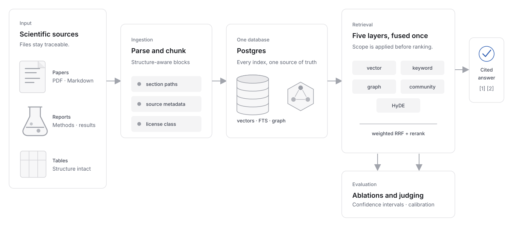

<section class="srag-home-section srag-home-masthead" markdown>

<div class="srag-home-masthead__brand">
  
  
</div>

# Retrieval-augmented generation over scientific document collections, on one Postgres database

<p class="srag-home-masthead__lede">A template repository that ingests your literature, keeps provenance and rights attached, retrieves through five fused layers, generates cited answers, and evaluates the whole path.</p>

<p class="srag-home-masthead__meta">v0.3.0a1, alpha, BSD-3-Clause. Install with pipx, the GitHub template, or a clone.</p>

</section>

<section class="srag-home-section srag-home-section--figure" markdown>

<figure class="srag-home-figure">
  
  <figcaption>One path from source document to evaluated answer.</figcaption>
</figure>

</section>

<section class="srag-home-section" id="demo" markdown>

<!-- BEGIN KIT ONBOARDING: removed from generated projects by sci_rag.scaffold.apply -->

## Start a project

Two lines, run from wherever you keep projects. The wizard asks about your domain, credentials, ontology, corpus, and environment manager, then writes a configured, git-initialized project directory. Every question has a default, so holding down Enter still leaves you with something that runs offline.

```console title="Terminal"
$ pipx install sci-rag-kit
$ sci-rag-new
```

<div id="srag-cast" class="srag-cast" data-cast="assets/casts/sci-rag-new.cast" aria-label="Recorded sci-rag-new session"></div>

The same session is written out under [Example](#example), so you can read and copy it without JavaScript.

Want to try the kit before starting anything? Clone it and run the demo. The bundled five-document corpus is synthetic, CC0, and small enough to run locally, and the offline embedder exercises ingestion, ranking, and retrieval evaluation without sending text to a model provider. No credentials.

```console title="Terminal"
$ git clone https://github.com/sustainability-software-lab/sci-rag-kit.git
$ cd sci-rag-kit
$ make setup
$ SCI_RAG_EMBEDDING_PROVIDER=local-hash make demo
```

[Quickstart](quickstart.md)

<!-- END KIT ONBOARDING -->

</section>

<section class="srag-home-section" id="components" markdown>

## Components

<div class="srag-defs" markdown>

Structure-aware ingestion
:   PDF, Markdown, and text become chunks that retain section paths and intact tables. [Follow ingestion into storage](architecture.md#data-model).

Five-layer retrieval
:   Vector, keyword, graph, community, and HyDE candidates meet in one weighted fusion. [See the retrieval design](methodology.md).

Postgres-native graph
:   Vectors, full-text search, concepts, relationships, and source records live together. [Read the decision record](adr/0001-graph-in-postgres.md).

Rights-aware scope
:   License and metadata filters are enforced inside every eligible layer before ranking. [Trace the rights contract](evidence-and-rights.md).

Cited answers
:   Every answer is assembled from numbered evidence, with a refusal when nothing is in scope. [Use REST or MCP](api.md).

Evaluation
:   Ablations, confidence intervals, blind judging, calibration, and corpus fingerprints turn quality claims into artifacts. [Evaluate your pipeline](evaluation.md).

</div>

</section>

<section class="srag-home-section" id="repository" markdown>

## One repository, specialized

The generator configures; it does not template. `sci-rag-new` fetches this repository at a pinned tag and rewrites its configuration files in place. There are no placeholders to render, and nothing that only becomes real code after generation. The repository you can read is the application you run, before and after.

<!-- BEGIN KIT ONBOARDING -->
`pipx install sci-rag-kit`, the GitHub template button, and a plain clone all leave you with the same tree.
<!-- END KIT ONBOARDING -->

`domain/` is the specialization surface: ontology, prompts, retrieval tuning, and evaluation questions. The rest of the tree stays ordinary Python that you can inspect, test, and change.

<pre class="srag-home-tree" aria-label="Annotated repository tree"><code>your-sci-rag/
├── domain/           ontology, prompts, eval questions
├── data/             your source documents and manifests
├── src/sci_rag/      ingestion through serving
├── migrations/       Postgres and pgvector schema
├── tests/            offline unit and integration evidence
├── infra/terraform/  optional Cloud SQL and Cloud Run
└── docs/             methods, guides, API, decisions</code></pre>

[Tour the repository](tour.md) · [Bring your own domain](bring-your-own-domain.md)

</section>

<section class="srag-home-section" id="start" markdown>

## Where to start

<div class="srag-rows" markdown>

[<span class="srag-row__title">Quickstart</span><span class="srag-row__copy">Set up Postgres, ingest the CC0 fixture corpus, inspect retrieval, and serve the same tools over REST and MCP.</span>](quickstart.md){ .srag-row }

[<span class="srag-row__title">Architecture</span><span class="srag-row__copy">Read the software map first, then the methodology specification and the decision records.</span>](architecture.md){ .srag-row }

[<span class="srag-row__title">Bring your own domain</span><span class="srag-row__copy">Define your ontology, prompts, source manifest, and questions without inventing a second framework.</span>](bring-your-own-domain.md){ .srag-row }

[<span class="srag-row__title">Discover a corpus</span><span class="srag-row__copy">Discover DOI candidates, review fail-closed rights resolution, then download verified direct PDFs into an ingestible manifest.</span>](campaigns.md){ .srag-row }

[<span class="srag-row__title">Evaluate your pipeline</span><span class="srag-row__copy">Run layer ablations, compare reports, calibrate the judge, and keep the corpus fingerprint attached.</span>](evaluation.md){ .srag-row }

[<span class="srag-row__title">Choosing Sci RAG Kit</span><span class="srag-row__copy">Compare the kit with LightRAG, PaperQA2, LlamaIndex, and Microsoft GraphRAG before you commit to it.</span>](choosing-sci-rag-kit.md){ .srag-row }

</div>

</section>

<section class="srag-home-section" id="principles" markdown>

## Design principles

<div class="srag-defs" markdown>

Preserve provenance
:   Source identity and section context survive ingestion, ranking, and citation.

Fail closed on rights
:   An empty license allowlist returns nothing. Unknown never means safe.

Make degradation visible
:   A timed-out layer becomes a trace, not a quietly weaker answer.

Earn complexity with evidence
:   Retrieval changes ship behind an ablation and stay only when measured.

</div>

No cache fleet, plug-in framework, graph sidecar, or hidden agent loop sits behind the quickstart. The defaults stay small enough to describe in a methods section. [Read the methodology](methodology.md) · [See the extension seams](extend.md)

</section>

<!-- BEGIN KIT ONBOARDING -->

<section class="srag-home-section" id="example" markdown>

## Example

The session above, in full. `scripts/render_cast.py` builds it by driving the real wizard, so it cannot drift from what `sci-rag-new` actually asks. Regenerate with `make cast`. `make docs` fails if you forget.

<!-- BEGIN GENERATED TRANSCRIPT: scripts/render_cast.py -->

```console title="Terminal"
$ pipx install sci-rag-kit
$ sci-rag-new
project_name (My Scientific KB): Membrane Materials KB
repo_name (membrane-materials-kb):
description (A short description of your domain.): Membrane chemistry and performance for water treatment
author_name (Your name, lab, or organization): Berkeley Lab
contact_email (Sent to OpenAlex, Crossref, and Unpaywall): you@lbl.gov
python_version (3.12):
Select environment_manager
1 - uv
2 - pixi
3 - conda
4 - venv+pip
Choose from [1/2/3/4] (1): 2
Select dependency_file
1 - pyproject.toml
2 - pixi.toml
Choose from [1/2] (1):
Select credentials
1 - google_ai_studio
2 - vertex_ai
3 - offline
Choose from [1/2/3] (1): 1
Select embedding_provider
1 - google
2 - local-hash
Choose from [1/2] (1):
llm_model (gemini-2.5-flash):
embedding_model (gemini-embedding-001):
embedding_dim (1536):
Select ontology
1 - draft_with_llm
2 - keep_demo_example
3 - blank
Choose from [1/2/3] (1): 1
Select corpus_source
1 - local_files
2 - openalex_topic
3 - doi_list
4 - demo_only
Choose from [1/2/3/4] (1): 2
openalex_topic (your topic): polyamide membrane fouling
max_results (100): 250
Select pdf_parser
1 - pypdf
2 - docling
Choose from [1/2] (1): 2
Select reranker
1 - none
2 - llm
3 - local_cross_encoder
Choose from [1/2/3] (1):
Select include_terraform
1 - Yes
2 - No
Choose from [1/2] (1): 2
Select include_demo_corpus
1 - Yes
2 - No
Choose from [1/2] (1): 2
Select open_source_license
1 - BSD-3-Clause
2 - MIT
3 - Apache-2.0
4 - No license file
Choose from [1/2/3/4] (1):
Select initialize_git
1 - Yes
2 - No
Choose from [1/2] (1):

  Drafting an ontology for "Membrane chemistry and performance for water treatment"...

  Entity types      Membrane, Material, Contaminant, Process, Property, Application, Organization, Standard
  Relation types    MADE_OF, REMOVES, HAS_PROPERTY, USED_IN, REQUIRES, COMPARED_WITH
  Query classes     performance, fabrication, fouling, application

  Accept this ontology? [y/n/redraft] (y):

Fetching sci-rag-kit for membrane-materials-kb...

Writing membrane-materials-kb/

  removed                docs/planning/, infra/terraform/, data/demo/, examples/
  domain/domain.yaml     8 entity types, 6 relation types, 4 query classes
  domain/eval_seed_questions.jsonl   guided blank
  .env                   google_ai_studio, gemini-2.5-flash, gemini-embedding-001
  pyproject.toml         name, description, extras: docling
  Makefile               commands prefixed with `pixi run`, database runs from conda-forge, no Docker
  docs/                  kit onboarding, player, and cast removed
  pyproject.toml         [tool.pixi] workspace, environments, tasks
  Dockerfile             pixi base image
  .devcontainer/         ghcr.io/prefix-dev/devcontainer-features/pixi:0
  rendered               8 files for pixi
  pixi.lock              created on first `pixi install`
  data/campaigns/        openalex topic "polyamide membrane fouling"
  LICENSE                BSD-3-Clause
  README.md              rewritten opening
  git                    initialized, 1 commit

Done. Membrane Materials KB is yours. Next:

  cd membrane-materials-kb
  pixi install
  pixi run sci-rag doctor
  make corpus
```

<!-- END GENERATED TRANSCRIPT -->

</section>

<!-- END KIT ONBOARDING -->
